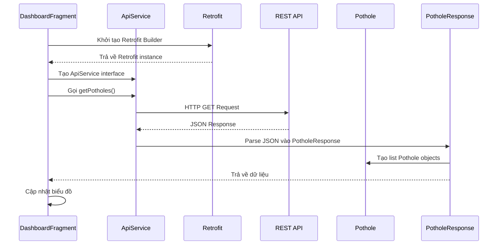

```mermaid
sequenceDiagram
    participant DF as DashboardFragment
    participant AS as ApiService
    participant R as Retrofit
    participant API as REST API
    participant P as Pothole
    participant PR as PotholeResponse
    
    DF->>R: Khởi tạo Retrofit Builder
    R-->>DF: Trả về Retrofit instance
    DF->>AS: Tạo ApiService interface
    DF->>AS: Gọi getPotholes()
    AS->>API: HTTP GET Request
    API-->>AS: JSON Response
    AS->>PR: Parse JSON vào PotholeResponse
    PR->>P: Tạo list Pothole objects
    PR-->>DF: Trả về dữ liệu
    DF->>DF: Cập nhật biểu đồ
```